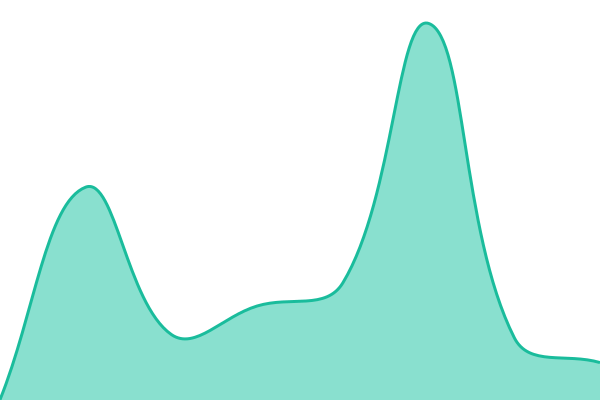
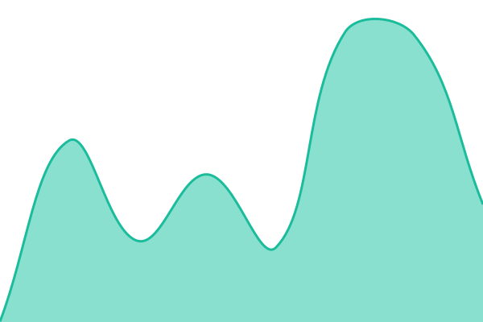
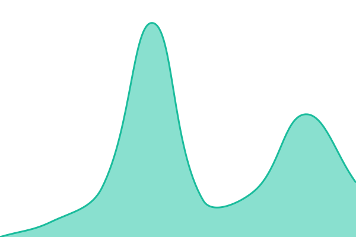
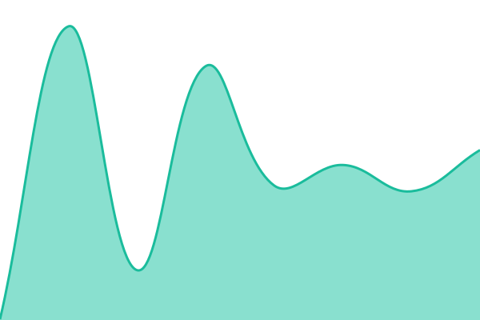

# [📈 Live Status](https://status.postroll.app): <!--live status--> **🟧 Partial outage**

This repository contains the open-source uptime monitor and status page for [postroll-app](https://status.postroll.app), powered by [Upptime](https://github.com/upptime/upptime).

With [Upptime](https://upptime.js.org), you can get your own unlimited and free uptime monitor and status page, powered entirely by a GitHub repository. We use [Issues](https://github.com/postroll-app/upptime/issues) as incident reports, [Actions](https://github.com/postroll-app/upptime/actions) as uptime monitors, and [Pages](https://status.postroll.app) for the status page.

<!--start: status pages-->
<!-- This summary is generated by Upptime (https://github.com/upptime/upptime) -->
<!-- Do not edit this manually, your changes will be overwritten -->
<!-- prettier-ignore -->
| URL | Status | History | Response Time | Uptime |
| --- | ------ | ------- | ------------- | ------ |
|  [Web app](https://postroll.app) | 🟩 Up | [web-app.yml](https://github.com/postroll-app/upptime/commits/HEAD/history/web-app.yml) | 

 432ms
     
 | 

<a href="https://status.postroll.app/history/web-app">100.00%</a>
    

|  [Help docs](https://help.postroll.app) | 🟩 Up | [help-docs.yml](https://github.com/postroll-app/upptime/commits/HEAD/history/help-docs.yml) | 

 352ms
     
 | 

<a href="https://status.postroll.app/history/help-docs">100.00%</a>
    

|  [Realtime / VTT](https://postroll-realtime.fly.dev/_health) | 🟩 Up | [realtime-vtt.yml](https://github.com/postroll-app/upptime/commits/HEAD/history/realtime-vtt.yml) | 

 135ms
     
 | 

<a href="https://status.postroll.app/history/realtime-vtt">100.00%</a>
    

|  [Database](https://postroll.app/api/status/db) | 🟩 Up | [database.yml](https://github.com/postroll-app/upptime/commits/HEAD/history/database.yml) | 

 613ms
     
 | 

<a href="https://status.postroll.app/history/database">99.68%</a>
    

|  [Cache (Redis)](https://postroll.app/api/status/redis) | 🟩 Up | [cache-redis.yml](https://github.com/postroll-app/upptime/commits/HEAD/history/cache-redis.yml) | 

 250ms
     
 | 

<a href="https://status.postroll.app/history/cache-redis">100.00%</a>
    

|  [File storage](https://postroll.app/api/status/r2) | 🟩 Up | [file-storage.yml](https://github.com/postroll-app/upptime/commits/HEAD/history/file-storage.yml) | 

 248ms
     
 | 

<a href="https://status.postroll.app/history/file-storage">99.68%</a>
    

|  [Payments](https://postroll.app/api/status/stripe) | 🟩 Up | [payments.yml](https://github.com/postroll-app/upptime/commits/HEAD/history/payments.yml) | 

 182ms
     
 | 

<a href="https://status.postroll.app/history/payments">100.00%</a>
    

|  [Email](https://postroll.app/api/status/email) | 🟩 Up | [email.yml](https://github.com/postroll-app/upptime/commits/HEAD/history/email.yml) | 

 200ms
     
 | 

<a href="https://status.postroll.app/history/email">100.00%</a>
    

|  [PDF export](https://postroll.app/api/status/pdf) | 🟩 Up | [pdf-export.yml](https://github.com/postroll-app/upptime/commits/HEAD/history/pdf-export.yml) | 

 170ms
     
 | 

<a href="https://status.postroll.app/history/pdf-export">99.54%</a>
    

|  [Share cards](https://postroll.app/api/status/og) | 🟥 Down | [share-cards.yml](https://github.com/postroll-app/upptime/commits/HEAD/history/share-cards.yml) | 

 217ms
     
 | 

<a href="https://status.postroll.app/history/share-cards">0.00%</a>
    

<!--end: status pages-->

[**Visit our status website →**](https://status.postroll.app)

## 📄 License

- Powered by: [Upptime](https://github.com/upptime/upptime)
- Code: [MIT](./LICENSE) © [Anand Chowdhary](https://anandchowdhary.com)
- Data in the `./history` directory: [Open Database License](https://opendatacommons.org/licenses/odbl/1-0/)
